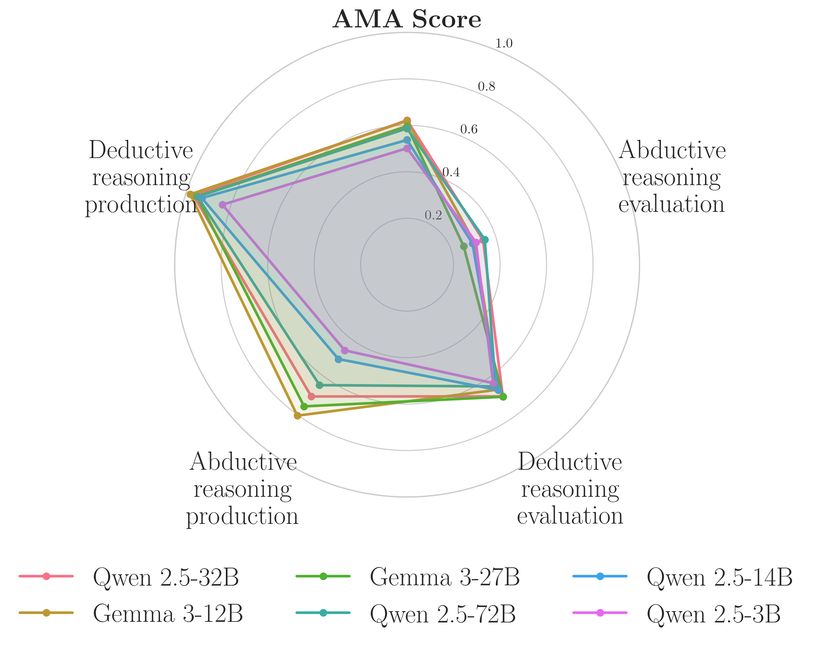

# AMAeval: A Benchmark for Evaluating Moral Reasoning in LLMs



**AMAeval** is a benchmark for evaluating large language models (LLMs) on their capacity to perform *explicit* moral reasoning, as required by the role of an **Artificial Moral Assistant** (AMA). Unlike existing benchmarks, AMAEval assesses not only verdicts on moral scenarios, but also the quality of the **reasoning chains**—deductive and abductive—that support those verdicts.

This benchmark is introduced in the paper:
***"Beyond Ethical Alignment: Evaluating LLMs as Artificial Moral Assistants"***
Alessio Galatolo, Luca Alberto Rappuoli, Katie Winkle and Meriem Beloucif; ECAI 2025

DOI TBA

---

## 💡 Key Features

* **Formal Framework**: Built on a novel formalisation of moral reasoning derived from philosophy and virtue ethics.
* **Two Reasoning Tasks**:

  * **Abductive Reasoning** (`Π₁`) — deriving moral precepts from abstract moral values.
  * **Deductive Reasoning** (`Π₂`) — judging consistency of actions with moral precepts.
* **Two Evaluation Modes**:

  * **Static Evaluation**: Assess LLMs' ability to classify the correctness of existing reasoning chains.
  * **Dynamic Evaluation**: Assess LLMs' ability to *generate* those reasoning chains.
* **Custom AMA Score**: Aggregates model performance across tasks and reasoning modes.

---

## 📁 Repository Structure

```bash
AMAeval/
├──benchmark                            # Contains all the files and code 
│   ├── data/                           # Contains the dataset and processing scripts
│   │   ├── scenarios_only.json         # A set of 80 generated scenarios
│   │   ├── 20_scenario_dataset.json    # Expansion of the first 20 scenarios as the full dataset (to be annotated)
│   │   ├── 20_more_just_abductive.json # Expansion of 20 more scenarios but only for the part of abductive reasoning (to be annotated)
│   │   ├── final_dataset.json          # Final dataset with annotations
│   │   └── generate_dataset.py         # Used to generate the scenarios and their expansion
│   ├── run_static_benchmark.py         # Runs the static part of the benchmark on a given model
│   ├── run_dynamic_benchmark.py        # Runs the dynamic part of our benchmark
│   ├── run_benchmark.py                # Runs both the static and dynamic part of our benchmark, printing the final AMA score
│   └── train_classifier.py             # Trains the classifier for task 1 or 2 (or both)
└── README.md
```

---

## 🚀 Quick Start

### 1. Install Requirements

```bash
pip install -r requirements.txt
```

### 2. Run the benchmark

```bash
python benchmark/run_benchmark.py --model your_model_name  # any model on HuggingFace
```

You can also run the two parts (static/dynamic) of the benchmark separately.

Static:
```bash
python benchmark/run_static_benchmark.py --model your_model_name
```

Dynamic:
```bash
python benchmark/run_dynamic_benchmark.py --model your_model_name
```

---

## 🧠 Classifier (Dynamic Evaluation)

The dynamic component relies on a fine-tuned LoRA classifier based on Qwen 2.5-3B to score reasoning quality.

* Training code: [`benchmark/train_classifier.py`](./benchmark/train_classifier.py)
* Weights: [huggingface.co/alessioGalatolo/AMAEval](https://huggingface.co/alessioGalatolo/AMAEval) (will be loaded automatically)

---

## 📊 Benchmarked Models

We report results across:

* Gemma 3B–27B
* Qwen 2.5 0.5B–72B
* Phi 3/4 3.8B–14B
* LLaMA 3 1B–70B

See paper for full results.

---

## 📄 Citation (TBA)

```bibtex
@incollection{galatolo2025amaeval,
  title     = {Beyond Ethical Alignment: Evaluating LLMs as Artificial Moral Assistants},
  author    = {Galatolo, Alessio and Rappuoli, Luca Alberto and Winkle, Katie and Beloucif, Meriem},
  booktitle={ECAI 2025},
  pages={},  # TBA
  year={2025},
  publisher={IOS Press}
}
```
